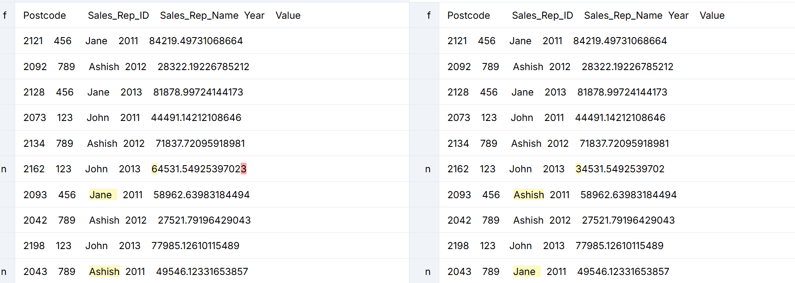

# DiffXcel

DiffXcel is a lightweight web application built with Flask that allows you to easily compare two Excel files (`.xlsx` format) and visualize the differences. It generates a clear, interactive HTML report highlighting changes between sheets and cells.

## Features

  * **Excel Comparison**: Upload two Excel files, and DiffXcel will compare them sheet by sheet.
  * **Detailed HTML Reports**: Generates an intuitive HTML report showing:
      * Sheets present only in the original file.
      * Sheets present only in the modified file.
      * Side-by-side differences for common sheets, highlighting added, changed, and deleted rows/cells.
  * **Downloadable Reports**: You can download the generated HTML report for offline viewing or sharing.
  * **User-Friendly Interface**: A simple and clean web interface for uploading files and viewing reports.
  * **Secure File Handling**: Uses `werkzeug.utils.secure_filename` to prevent directory traversal vulnerabilities and enforces a file size limit.

## How it Works

DiffXcel leverages the `openpyxl` library to read Excel files and `difflib.HtmlDiff` to generate the visual differences. Each sheet is converted into a list of tab-separated lines, allowing `HtmlDiff` to effectively compare their contents. The application then aggregates these differences into a single, comprehensive HTML report.



*A visual representation of DiffXCel in action, showcasing a clear, color-coded comparison report.*

## Getting Started

Follow these steps to set up and run DiffXcel locally.

### Prerequisites

Before you begin, ensure you have the following installed:

  * **Python 3.x**: Download from [python.org](https://www.python.org/).
  * **pip**: Python's package installer (usually comes with Python).

### Installation

1.  **Clone the repository:**

    ```bash
    git clone https://github.com/sonnylaskar/DiffXcel.git
    cd DiffXcel
    ```

2.  **Create a virtual environment (recommended):**

    ```bash
    python -m venv venv
    source venv/bin/activate  # On Windows, use `venv\Scripts\activate`
    ```

3.  **Install the required dependencies:**

    ```bash
    pip install -r requirements.txt
    ```

    *If you don't have a `requirements.txt` file, you can create one with:*

    ```bash
    pip install Flask openpyxl beautifulsoup4
    pip freeze > requirements.txt
    ```

### Running the Application

Once you have installed the dependencies, you can run the Flask application:

```bash
python app.py
```

The application will typically run on `http://127.0.0.1:5000/`. Open this URL in your web browser.

## Usage

1.  **Open the Application**: Navigate to `http://127.0.0.1:5000/` in your web browser.
2.  **Upload Files**: You will see a form with two file input fields: "Original File" and "Modified File."
3.  **Select Excel Files**: Click "Choose File" for each input and select your `.xlsx` files.
4.  **Generate Report**: Click the "Compare Files" button.
5.  **View Report**: The application will process the files and display the diff report directly on the page.
6.  **Download Report**: You will also find a link to download the full HTML report for future reference.

## Project Structure

```
DiffXcel/
├── app.py                  # The main Flask application file
├── requirements.txt        # Python dependencies
├── uploads/                # Directory for temporarily storing uploaded Excel files
├── reports/                # Directory for storing generated HTML reports
└── templates/
    └── index.html          # The main HTML template for the web interface
```

## Contributing

Contributions are welcome\! If you have suggestions for improvements, bug fixes, or new features, please feel free to:

1.  Fork the repository.
2.  Create a new branch (`git checkout -b feature/your-feature-name`).
3.  Make your changes.
4.  Commit your changes (`git commit -m 'Add new feature'`).
5.  Push to the branch (`git push origin feature/your-feature-name`).
6.  Open a Pull Request.

## License

This project is licensed under the Apache License 2.0 - see the [LICENSE](LICENSE) file for details.